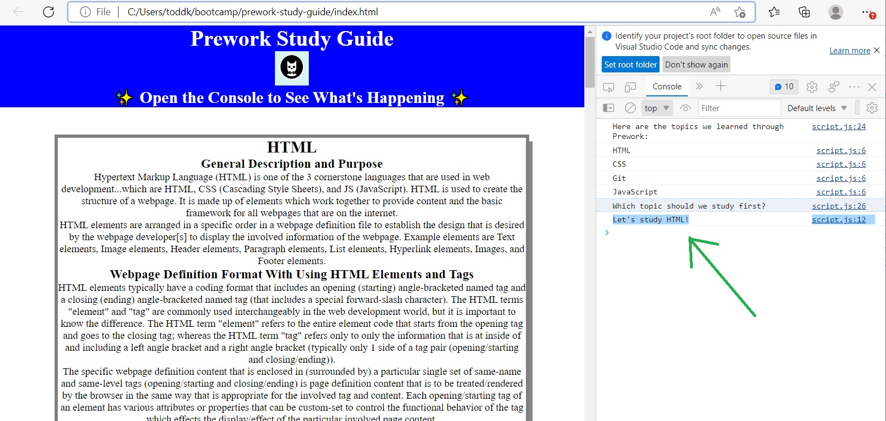

# Boot Camp Prework Study Guide Webpage

## Description

This application is a study guide tool that is used for viewing Full-Stack Web Development Coding boot camp course pre-work information for later reference as-needed. The study guide was created because it was a required learning project assignment of the involved boot camp that the student author participated in. The study guide contains notes about HTML, CSS Git, and JavaScript.

The assignment and task of creating the study guide was a logical and effective mechanism for the student to experience and benefit from a good orientation to the boot camp. The assignment was expected to be completed during the 2 or 3 weeks that were before the 1st day of the boot camp classes. The information and procedures that were involved and necessary for the creation of the study guide were a good comprehensive general introductory overview of many of the topics and processes and objectives that the boot camp would routinely include. That pre-class overview allowed for the student to be well-prepared for--and more-comfortable about--the 1st day of class. And the student then also had a useful tool for refreshing his memory about the involved routine topics when they continued to be being learned and memorized during the beginning days/weeks of the boot camp classes.

## Installation

NA

## Usage

To use this study guide...simply view the notes in each section depending on your topic interest preference. If you are not sure about your 1st or next topic pick and you want a suggestion...then you can use the topic-suggestion automatic feature of the study guide. To use that feature...open the Chrome DevTools component of the Chrome browser (if you have that system; and by pressing Command+Option+I (Mac) or Control+Shift+I (Windows))...and that system will contain a Console window that will display the topic suggestion information.

## Credits

NA

## License

The last section of a high-quality README file is the license. This lets other developers know what they can and cannot do with your project. If you need help choosing a license, refer to [https://choosealicense.com/](https://choosealicense.com/).
